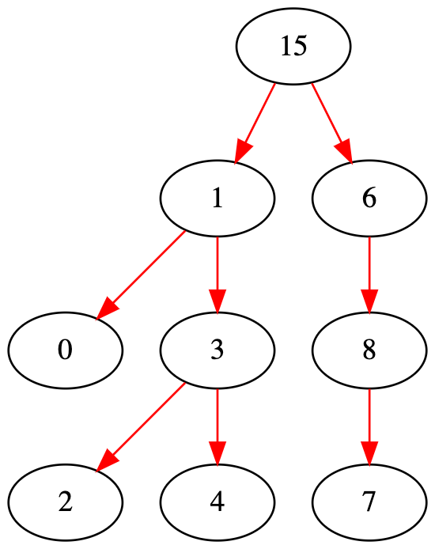

# Different way of printing binary tree order

## pre-order

Left to right & right to left, recursion and no recursion

## in-order

Left to right & right to left, recursion and no recursion

## post-order

Left to right & right to left, recursion and no recursion

## level-order

Left to right & right to left

## level-order, reversely

print leaves first, Left to right & right to left

